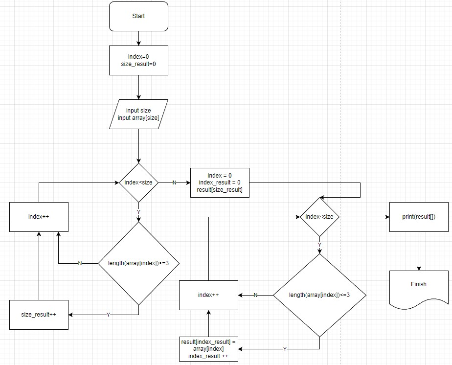

# Итоговая работа за превую четверть #

## Итоговая проверочная работа ##

## Алгоритм

### Описание решения

1. Объявляем два индекса,  вводим размер массива и массив с клавиатуры.

2. Считаем проверочным циклом количество элементов массива с размером меньше или равно 3 и записываем в переменную size_result.

3. Объявляем искомый массив размером size_result.

4. Запускаем повторно цикл на проверку длины элемента массива <=3 и записываем в искомый массив если длина элемента <=3.
   
5. Выводим искомый массив на экран.

Второй цикл можно было бы не запускать, если бы не надо было заранее объявлять размер массива, например в Python.

